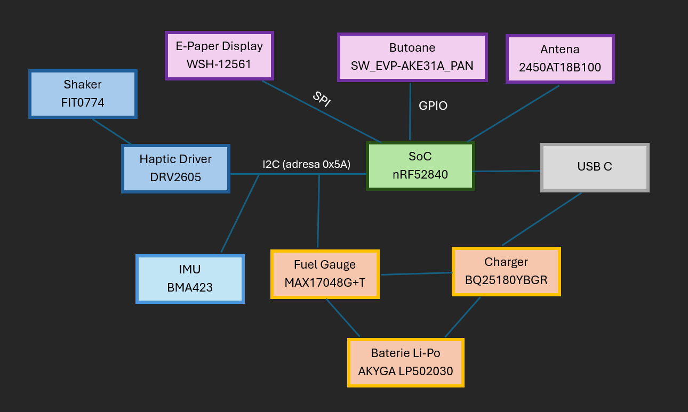

# InkTime - Smartwatch Open Source cu E-Paper
#### Proiect realizat de Gheorghe Mara, Facultatea de Automatica si Calculatoare din cadrul universitatii Politehnica Bucuresti
##### *Alegerea si organizarea schematica a componentelor a fost realizata de catre echipa de Testarea Sistemelor de Calcul (TSC)

InkTime este un proiect de smartwatch open-source bazat pe SoC-ul, conceput pentru a oferi o autonomie ridicata. Dispozitivul include senzori, interfata haptica si un sistem eficient de management al energiei.

## 1\. Diagrama Bloc

-----

## 2\. Bill of Materials (BOM)

| Nume produs | Ref | Qty | Link achizitionare | Datasheet |
| :--- | :--- | :--- | :--- | :--- |
| **nRF52840** | U1 | 1 | [JLC Parts](https://jlcpcb.com/partdetail/NordicSemicon-NRF52840_QFAA_FR7/C3606653) | [Datasheet](https://jlc-prod-smt.oss-eu-central-1.aliyuncs.com/smtDataManualFile/8589839228180852736-C3606653.pdf) |
| **BQ25180YBGR** | IC1 | 1 | [JLC Parts](https://jlcpcb.com/partdetail/TexasInstruments-BQ25180YBGR/C3682423) | [Datasheet](https://www.ti.com/cn/lit/gpn/bq25180) |
| **RT6160AWSC** | IC9 | 1 | [JLC Parts](https://jlcpcb.com/partdetail/RichtekTech-RT6160AWSC/C7065276) | [Datasheet](https://www.richtek.com/SaveDownload.aspx?specid=RT6160A) |
| **2450AT18B100E** | ANT1 | 1 | [JLC Parts](https://jlcpcb.com/partdetail/JohansonDielectrics-2450AT18B100E/C2917717) | [Datasheet](https://www.mouser.com/catalog/specsheets/johanson_2450AT18B100E.pdf) |
| **CPF0201D7K68C1** | R1\_EP\_DR, R1\_USB, R2, R2\_EP\_DR, R2\_USB, R3, R4, R5, R7, R8, R9, R17, R18, R\_PWR\_EPD, R\_TYPE\_SEL | 15 | [JLC Parts](https://jlcpcb.com/partdetail/TEConnectivity-CPF0201D10KC1/C4187156) | [Datasheet](https://www.te.com/commerce/DocumentDelivery/DDEController?Action=showdoc&DocId=Data+Sheet%7F1773200%7FN%7Fpdf%7FEnglish%7FENG_DS_1773200_N.pdf%7F2176451-219) |
| **503480-2400** | J1 | 1 | [JLC Parts](https://jlcpcb.com/partdetail/MOLEX-5034802400/C122434) | [Datasheet](https://www.molex.com/en-us/products/part-detail-pdf/5034802400?display=pdf) |
| **BMA423** | IC3 | 1 | [JLC Parts](https://jlcpcb.com/partdetail/BoschSensortec-BMA423/C189517) | [Datasheet](https://www.micro-semiconductor.dk/datasheet/f1-SHUTTLE-BOARD-BMA423.pdf) |
| **KH-TYPE-C-16P** | J4 | 1 | [SnapEDA](https://www.snapeda.com/parts/KH-TYPE-C-16P/Kinghelm/view-part/?ref=eda) | [Datasheet](https://www.snapeda.com/parts/KH-TYPE-C-16P/kinghelm/datasheet/) |
| **MAX17048G+T10** | U3 | 1 | [JLC Parts](https://jlcpcb.com/partdetail/2777647-MAX17048GT10/C2682616) | [Datasheet](https://www.analog.com/media/en/technical-documentation/data-sheets/max17048-max17049.pdf) |
| **SW\_EVP-AKE31A\_PAN** | SW\_DW, SW\_ENT, SW\_UP | 3 | [JLC Parts](https://jlcpcb.com/partdetail/PANASONIC-EVPAKE31A/C569760) | [Datasheet](https://industrial.panasonic.com/cdbs/www-data/pdf/ATK0000/ATK0000C434.pdf) |
| **USBLC6-2SC6Y** | D3 | 1 | [JLC Parts](https://jlcpcb.com/partdetail/STMicroelectronics-USBLC62SC6Y/C2969755) | [Datasheet](https://www.st.com/resource/en/datasheet/usblc6-2sc6y.pdf) |
| **DMG2305UX-7** | Q1 | 1 | [JLC Parts](https://jlcpcb.com/partdetail/HXYMOSFET-DMG2305UX7/C5261054) | [Datasheet](https://ro.mouser.com/datasheet/3/175/1/DMG2305UX.pdf) |
| **SI1308EDL-T1-GE3** | Q3 | 1 | [JLC Parts](https://jlcpcb.com/partdetail/VishayIntertech-SI1308EDL_T1GE3/C469327) | [Datasheet](https://www.vishay.com/docs/63399/si1308edl.pdf) |
| **MLP2016SR47MT0S1** | L7 | 1 | [JLC Parts](https://jlcpcb.com/partdetail/TDK-MLP2016SR47MT0S1/C87545) | [Datasheet](https://product.tdk.com/system/files/dam/doc/product/inductor/inductor/smd/catalog/inductor_commercial_power_mlp2016_en.pdf?ref_disty=mouser) |
| **DRV2605YZFR** | IC2 | 1 | [JLC Parts](https://jlcpcb.com/partdetail/TexasInstruments-DRV2605YZFR/C81079) | [Datasheet](https://www.ti.com/lit/gpn/drv2605) |
| **MBR0530** | D2, D4, D5 | 3 | [JLC Parts](https://jlcpcb.com/partdetail/78464-MBR0530/C77336) | [Datasheet](https://www.mouser.com/datasheet/2/149/MBR0530-278428.pdf?srsltid=AfmBOooSAZoa8so3pP-i9vcfPlQxmrwC54qe5hRXrsz8dz221j7a6TXz) |
| **744043680** | L5 | 1 | [JLC Parts](https://jlcpcb.com/partdetail/WurthElektronik-744043680/C2045671) | [Datasheet](https://www.we-online.com/components/products/datasheet/744043680.pdf?srsltid=AfmBOoo9TRHsdSxuJOAEDWqQIoKyAKwPijYRuvauZ0_ie3OOrPimxtTn) |
| **C0402C333J4RECAUTO7411** | C1-EP-DR, C2-EP-DR, C6, C14, C20, C21, C24, C25, C33, C37, C38, C39, C43, EPD\_C1-EPD\_C12 | 25 | [JLC Parts](https://jlcpcb.com/partdetail/KEMET-C0402C333J4RECAUTO7411/C3845464) | [Datasheet](https://eu.mouser.com/datasheet/3/508/1/KEM_C1090_X7R_ESD.pdf) |
| **02016D105KAT2A** | C1-C5, C7-C13, C15-C19, C22, C23, C27, C29-C32, C34, C42 | 26 | [JLC Parts](https://jlcpcb.com/partdetail/-02016D105KAT2A/C5853878) | [Datasheet](https://datasheets.kyocera-avx.com/cx5r-KGM.pdf) |
| **GRM011R60J152KE01L** | C23, C27, C34, C42 | 4 | [JLC Parts](https://jlcpcb.com/partdetail/KEMET-C0402C333J4RECAUTO7411/C3845464) | [Datasheet](https://www.google.com/search?q=https://www.murata.com/en-global/products/productdetail%3Fpartno%3DGRM011R60J152KE01%2523) |
| **ABM11-27.000MHz-D7X-T** | X1 | 1 | [JLC Parts](https://jlcpcb.com/partdetail/AbraconLLC-ABM11_27_000MHZ_D7XT/C1999784) | [Datasheet](https://eu.mouser.com/datasheet/3/184/1/ABM11.pdf) |
| **LFXTAL061361CUTT** | X2 | 1 | [Wiselink](https://wiselink.com.sg/cn/product/lfxtal061361cutt/) | [Datasheet](https://www.iqdfrequencyproducts.com/products/pn/LFXTAL061361Bulk.pdf) |
| **ATFC-0402-3N3-B-T** | L2, L3 | 2 | [JLC Parts](https://jlcpcb.com/partdetail/AbraconLLC-ATFC_0402_3N3BT/C2043462) | [Datasheet](https://eu.mouser.com/datasheet/3/184/1/ATFC_0402.pdf) |

-----

## 3\. Functionalitate Hardware

### Arhitectura Sistemului

1. [SoC nRF52840](https://jlc-prod-smt.oss-eu-central-1.aliyuncs.com/smtDataManualFile/8589839228180852736-C3606653.pdf)
  - include un nucleu ARM Cortex-M4F la 64MHz, 1MB Flash si 256KB RAM
  - coordoneaza toate functiile dispozitivului.
2. [IMU BMA423](https://www.micro-semiconductor.dk/datasheet/f1-SHUTTLE-BOARD-BMA423.pdf)
  - accelerometru triaxial cu pedometru integrat
  - legat prin I2C (adresa 0x18) 
  - are doua linii de intrerupere pentru wake-on-motion.
2. [Baterie Li-Po AKYGA LP502030](https://www.tme.eu/Document/b9e12bf26ad0ba929a22ab5d58f022cd/AKY0106.pdf)
  - baterie litiu-polimer de 400 mAh, 3.7V
  - dimensiuni de 32.5 x 21.0 x 5.5 mm ce permit integrarea in carcasa, sub PCB
3. [Display E-Paper WSH-12561](https://www.tme.eu/Document/0ca57a8ffbcd57b5bca53252eb9d6ec3/WSH-12561.pdf)
  - e-Paper cu rezolutie de 200x200 pixeli
  - controlat prin SPI pentru viteza ridicata si eficienta energetica
  - circuitul de boost (L5 si diode MBR0530) genereaza tensiunile necesare pixelilor
  - dimensiunile placii sunt 48 x 33 mm, iar display-ul efectiv are 37.32 x 31.8 mm
  - consum redus multumita tehnologiei bistabile ce retine imaginea fara curent.
4. [Shaker FIT0774](https://www.tme.eu/ro/details/df-fit0774/motoare-dc/dfrobot/fit0774/)
  - feedback-ul tactil este oferit de un motor ERM controlat de driver-ul dedicat DRV2605
  - asigura alerte prin vibratii pentru notificari sau interactiuni cu butoanele
5. [Haptic Driver DRV2605](https://www.ti.com/lit/gpn/drv2605)
  - controleaza motorul de vibratii ERM prin I2C (adresa 0x5A)
  - este activat prin pinul HAPTIC_EN

### Management Energie

  * **Incarcare Baterie:** BQ25180 gestioneaza incarcarea LiPo prin USB-C si monitorizeaza starea prin I2C (adresa 0x6A).
  * **Regulator Tensiune:** RT6160AWSC asigura o sina stabila de 3.3 mm (sina 3V3) din tensiunea bateriei (3.0-4.2 mm). Adresa I2C este 0x75.
  * **Monitorizare:** MAX17048 estimeaza starea de incarcare (SoC) fara rezistenta de sunt, comunicand prin I2C (adresa 0x36).

### Calcule Consum

In modul deep sleep, curentul estimat este de ~110uA. In timpul refresh-ului ecranului, consumul atinge 26-30mA. Cu o baterie de 400mAh, autonomia este de aproximativ 5-7 zile in conditii de utilizare medie.

-----

## 4\. Alocare Pini nRF52840

| Pin | Functie | Justificare |
| :--- | :--- | :--- |
| **P0.02** | SPI SCK | Master clock pentru display, ales pentru rutare directa. |
| **P0.03** | SPI MOSI | Transfer date imagine catre conectorul FPC J1. |
| **P0.05** | EPD CS | Chip select dedicat pentru display-ul e-paper. |
| **P0.06** | I2C SDA | Magistrala partajata pentru toti senzorii si IC-urile de putere. |
| **P0.07** | I2C SCL | Clock shared pentru magistrala I2C de 400kHz. |
| **P0.11** | PMIC\_INT | Intrerupere de la incarcatorul BQ25180 pentru status incarcare. |
| **P0.12** | HAPTIC\_EN | Activeaza driverul DRV2605 pentru feedback tactil. |
| **P0.13** | SW1 | Intrare buton UP, cu pull-up hardware de 10kohm. |
| **P0.14** | SW2 | Intrare buton ENTER (Confirmare). |
| **P1.02** | SW3 | Intrare buton DOWN. |
| **P1.01** | EPD Power EN | Controleaza gate-ul MOSFET-ului Q1 pentru a taia alimentarea display-ului in sleep. |
| **P0.00/0.01** | XL1 / XL2 | Conexiune obligatorie pentru cristalul de ceas low-power (32.768kHz). |

-----

## 5\. Implementare si Decizii de Design

### Pasi de Implementare

1. **Schematica componentelor si a semnalelor:** realizata conform schemei propuse de echipa de TSC

2.  **Layout PCB si rutare:**
    - Placa are straturile TOP si GND cu dimensiuni de 36x38 mm si o grosime de 1 mm.
    - Toate componentele sunt pe stratul TOP
    - Rutele nu formeaza unghiuri drepte
    - Antena este plasata la marginea placii, cu un decupaj complet in cupru sub ea pentru a evita interferentele

3. **Realizarea modelului 3D:**
    - Modelele pentru fiecare componenta au fost descarcate de pe [Component Search Engine](https://componentsearchengine.com)
    - Modelele pentru baterie, display si shaker au fost simplificate sub forma a 2 paralelipipede si un cilindru, respectand dimensiunile reale
    - Produsul final a fost asamblat, apoi componentele au fost mutate pentru a obtine efectul de "exploded view"

4. **Review:**
    - Am analizat proiectul colegului de review si am semnalat erorile de implementare, am sugerat imbunatatiri pentru design si documentatie
    - Am rezolvat bug-urile si sugestiile lasate de coleg la proiectul meu

### Decizii luate

  1. Erori acceptate DRC:

    - Clearance Error la butoane din cauza design-ului acestora
    - Clearance Error la vias-uri plasate direct sub pini
    - Clearance Error unde mai multe rute se conecteaza la aceeasi componenta, pe pini alaturati
    - Airwire Error semnalate de Fusion desi firul era clar conectat la pini (nu exista eroare de unrouted)
  
  2. Lipsesc etichetele pentru rezistente pe silkscreen pentru a nu ingramadi placa
  
  3. Antena a fost plasata in coltul din stanga jos al placii, unde nu sunt puse componente, pentru a minimiza zgomotul asupra semnalului

### Structura Repository

    - Hardware
    |-- fisierul schematic (.sch)
    |-- fisierul cu board-ul (.brd)
    |-- print-out al fisierului schematic (.pdf)
    - Manufacturing
    |-- gerbers.zip
    |-- fisierul Bill of Materials (.bom)
    |-- fisierul Pick and Place (.cpl)
    - Mechanical
    |-- fisierul 3D cu dispozitivul complet (PCB + baterie + display + carcasa) - exploded view (.step)
    |-- fisierul 3D Fusion360 cu PCB-ul complet
    |-- fisierul 3D Fusion360 cu dispozitivul complet
    - Images
    |-- imagini cu randări ale dispozitivului si plăcii
    - LICENSE
    - README.md
  